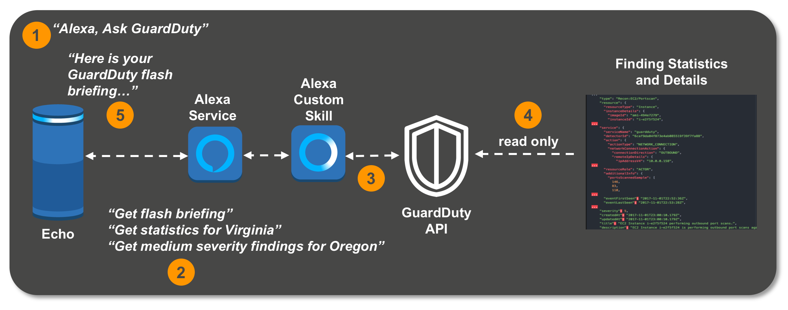

# Alexa - Ask GuardDuty - Prototype

## Skill Diagram

## Features
- Multi-Region support
- DetectorId auto discovery
- "Ask GuardDuty to get Flash Briefing" powered by get_findings_statistics. Uses an environment variable with comma separated region ids.
- Response provides high / med / low severity labels
- instance id / ip redaction
- help
- Error detection for disabled / regions not configured
- CloudFormation deployment for Lambda component

## Intent examples
*Open GuardDuty*
*Ask GuardDuty to get Flash Briefing*
*Get statistics for Virginia*
*Get high severity findings for Oregon*
*help*

## Variables
**MAXRESP = os.environ['MAXRESP']**

Max number of findings to return. Although 50 can be returned without paginating,
keeping this below 15 is a good idea to avoid Alexa size limit and general sanity preservation.

**FLASHREGIONS = os.environ['FLASHREGIONS']**

Comma separated list of region codes with NO spaces to include in flash briefing stats.
***Make sure GuardDuty is enabled in regions declared***

## Deployment Personal Dev Account - Not for Publication

1. Deploy CloudFormation Template.
2.  Go to [Amazon Dev Console](https://developer.amazon.com/alexa/console)
3. Paste Skill JSON into Skill Builder Code Editor in **Interaction Model**. Save / Build
4. Get Outputs: AlexaAskGDSkillArn from stack and paste into Lambda endpoint field in skill **Configuration**

***[Alexa for Business Deployment - WIP](https://aws.amazon.com/alexaforbusiness/getting-started/)***

## License

This library is licensed under the Apache 2.0 License. 
